# CPTR480 Quadrature SDR Hardware Documentation

This repository contains the KiCad schematics, PCB layouts, and Bills of Materials for the CPTR480 Quadrature Software Defined Radio (SDR) receiver board designed by Jeffrey McCormick and Daniel Mendoza for ENGR357.

**Other contributors**: Riley Smith, Joshua Garbi

## System Architecture

The radio is a direct-conversion, quadrature-sampling receiver (commonly utilizing a Tayloe Detector topology) managed by a Raspberry Pi Pico. The RF front-end downconverts the incoming antenna signal directly to baseband I (In-phase) and Q (Quadrature) audio signals, which are digitized and processed by the RP2040 microcontroller. The board also includes other parts like rotary encoder, OLED display, SD card reader, and DAC for audio output for added functionality. The radio is designed work both on battery power as well as USB power through the Raspberry Pi Pico. The board is designed to be portable and hand-held. 

### Core Hardware Modules

1. **Microcontroller & Digital Core**
   - **Raspberry Pi Pico (RP2040)**: The brains of the SDR. Handles I2C UI/Hardware control, I2S digital audio streams, DSP, and SD card interfacing. The board will support both the original Raspberry Pi Pico board varients and the YD2040 from CPTR480. 

2. **RF Front-End & Mixing (Tayloe Detector)**
   - **SN74CBT3253CDBR**: Dual 1-of-4 FET Multiplexer/Demultiplexer. This high-speed analog switch acts as the quadrature mixer, sequentially sampling the incoming RF signal at the Local Oscillator frequency to produce differential baseband I and Q signals.
   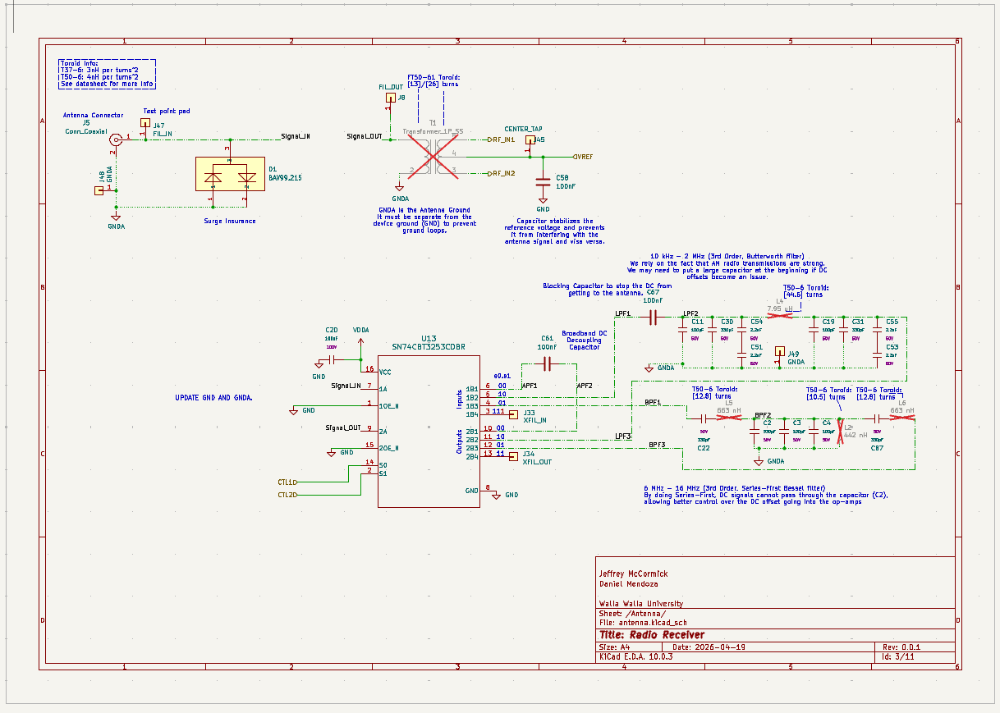
   - **SN74AC74DR**: Dual D-Type Positive-Edge-Triggered Flip-Flop, typically used to accurately divide the synthesized clock to drive the Tayloe detector switches with precise 90-degree phase offsets.
   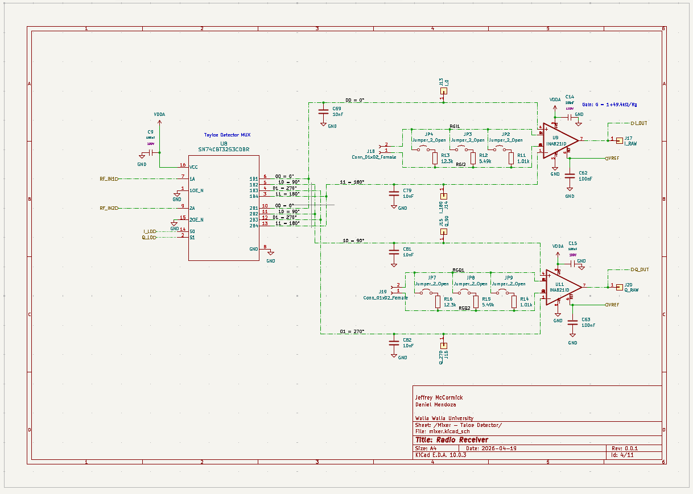
3. **Clock Generation**
   - **Si5351A-B-GT**: I2C-programmable ANY-frequency CMOS clock generator. Driven by a high-precision **24.576 MHz TCXO** (ASTX-H11) for ultra-low drift, it synthesizes the Local Oscillator (LO) frequencies. For quadrature mixing, it is configured to output signals at 4x the target listen frequency.
   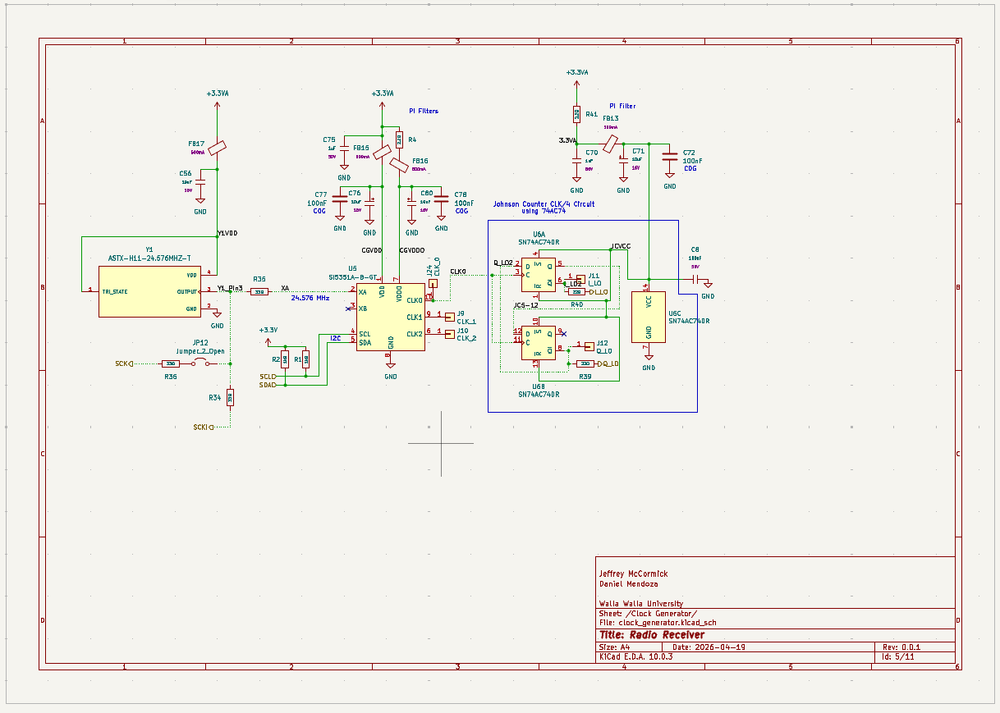
   

4. **Baseband Amplification**
   - **INA821ID**: High-precision instrumentation amplifiers used to convert the differential outputs of the Tayloe mixer to single-ended signals and apply initial low-noise gain.
   - **OPA1612AxD**: Dual SoundPlus™ high-performance bipolar-input audio operational amplifiers for active low-pass filtering and final baseband gain stages.

5. **Data Converters (Audio/Baseband)**
   - **PCM1808PWR**: 24-bit, 96-kHz Stereo ADC. Digitizes the analog I and Q baseband signals and sends them to the Pico over I2S.
   - **PCM5102A**: 32-bit, 384-kHz Stereo DAC with integrated PLL. Converts the final DSP-processed audio or playback audio from the Pico back to analog for the headphone output.
   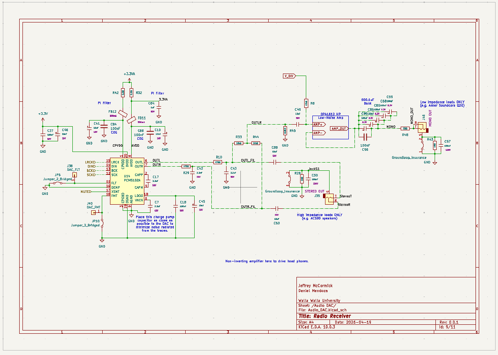

6. **User Interface**
   - **0.96" OLED Display**: 128x64 pixels, I2C interface.
   - **Rotary Encoder (Alps EC11)**: Includes a push-button switch for frequency tuning and menu navigation.
   - **Tactile Button**: For additional UI control inputs.

7. **Power Management**
   - **TPS7A2045PDQN**: 4.5V Ultra-Low-Noise LDO regulator for sensitive analog components.
   - **TPS72733DSER**: 3.3V Low-Dropout regulator for clean digital/mixed-signal voltage rails.
   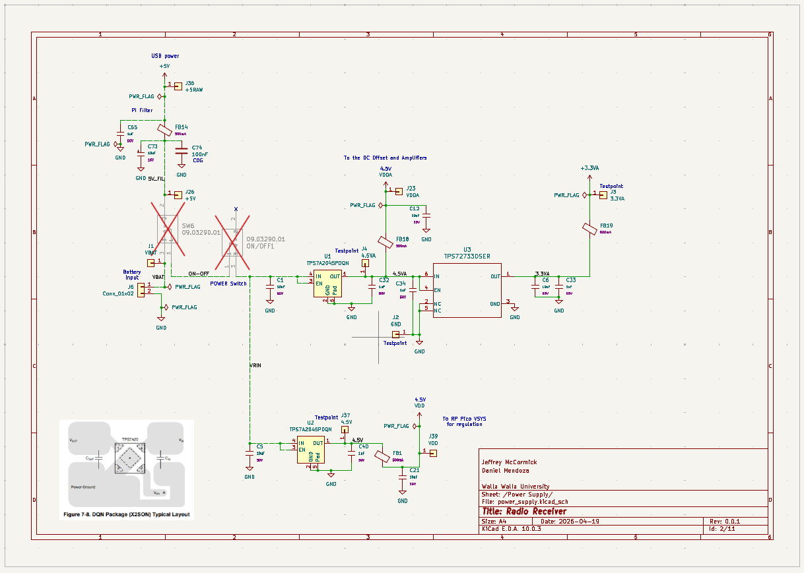

8. **Connectivity**
   - **BNC Connector (Amphenol)**: Main RF antenna input.
   - **3.5mm Audio Jacks (CUI SJ-3523-SMT)**: For SDR audio output and DAC direct output.
   - **MicroSD Card Slot**: Connected via SPI for playing WAV files or potentially recording IQ streams.

## KiCad Project Structure

The hardware source files are located in the `Radio_Receiver_McCormick_Mendoza` directory. The schematic is built hierarchically:

- **`Radio_Receiver_McCormick_Mendoza.kicad_sch`**: The top-level schematic tying all functional blocks together.
- **`antenna.kicad_sch` / `low_pass_filter.kicad_sch`**: Front-end filtering blocks.
- **`mixer.kicad_sch`**: The Tayloe detector and RF switching core.
- **`clock_generator.kicad_sch`**: Si5351 synthesizer and TCXO.
- **`ADC-24bit.kicad_sch` / `Audio_DAC.kicad_sch`**: Data converter sub-sheets.
- **`raspberry_pi_pico.kicad_sch`**: MCU pinning and decoupling.
- **`power_supply.kicad_sch`**: LDOs and power distribution network.
- **`Display.kicad_sch` / `Angle_Encoder.kicad_sch`**: UI peripherals.

### PCB Images
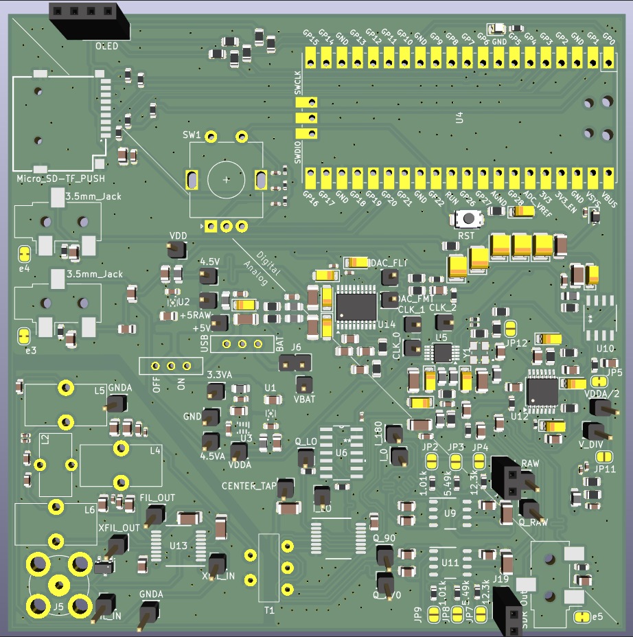
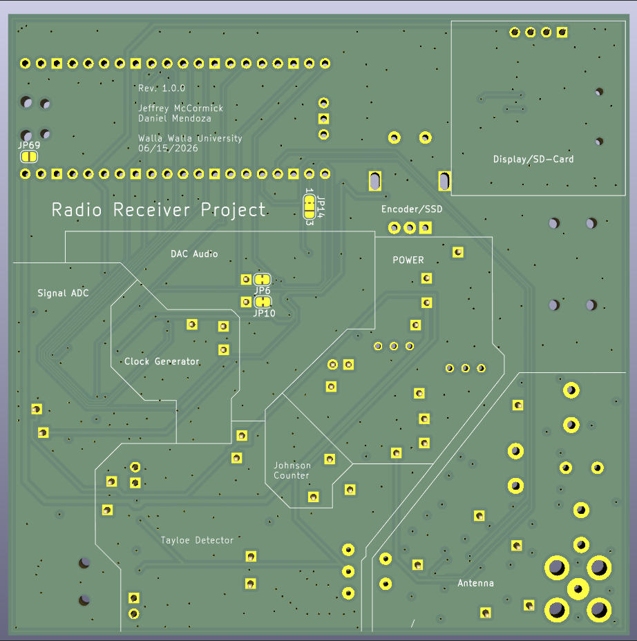
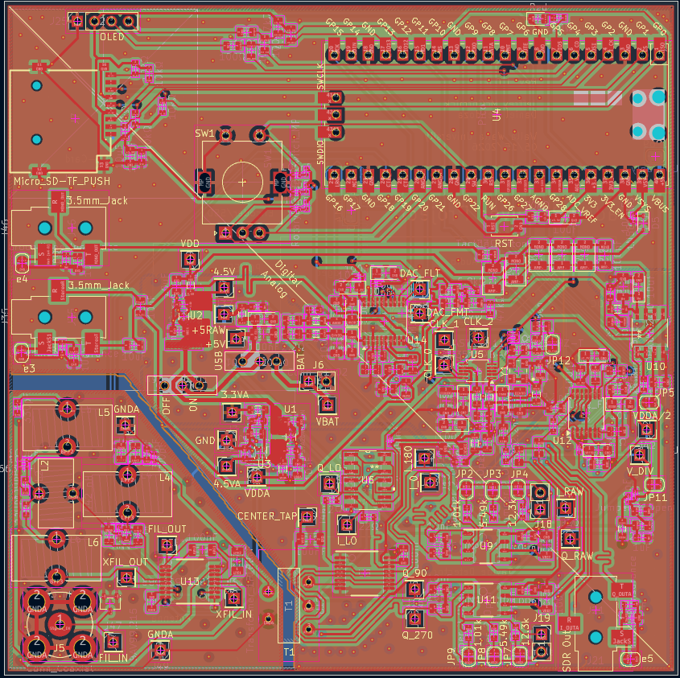

### Bill of Materials (BOM)

The complete component list, including LCSC part numbers for JLCPCB assembly, can be found in `Radio_Receiver_McCormick_Mendoza.csv`.

## Bring-up and Testing Order

Standalone scripts used during hardware validation. Each can be uploaded and run independently on the board.

| Component | File | Function | Pass/Fail |
|-----------|------|----------|-----------|
| LED | `Bringup/led_blink.py` | Blinks GPIO5 to confirm basic GPIO and upload toolchain | — |
| I2C bus | `Bringup/i2c_scan.py` | Scans I2C0 (SDA=12, SCL=13); expects Si5351 at `0x60`, OLED at `0x3C` | — |
| OLED display | `Bringup/oled_test.py` | Full exercise suite for the SSD1306 (text, lines, animation, contrast, power cycle) via `ssd1306.py` | — |
| Rotary encoder + button | `Bringup/rotary_encoder.py` | `QuadratureEncoder` (detent counting on GPIO 20/21) and `ButtonHandler` (debounced click + long-press on GPIO 22) | — |
| Si5351 clock | `Bringup/si5351_test.py` | Register R/W test, PLL lock check, 10.24 MHz quadrature setup, frequency sweep with integer-divider validation | — |
| Filter MUX | `Bringup/filter_mux_control.py` | Drives CTL1 (GPIO19) and CTL2 (GPIO18) to select one of four analog filter paths | — |
| Si5351 driver | `Bringup/Load_files/si5351.py` | I2C driver: PLL/multiplier config, per-clock dividers, phase offset, output enable | — |
| OLED driver | `Bringup/Load_files/ssd1306.py` | Standard MicroPython SSD1306 I2C framebuffer driver | — |

**`si5351_test.py` details:** Configures PLLA with N=25 (VCO = 24.576 MHz × 25 = 614.4 MHz), sets CLK0/1/2 dividers, and applies phase offsets of 0°, 90°, and 180° via `set_phase()`. The `is_integer_divider()` helper ensures only frequencies that divide the VCO evenly are programmed during the sweep.

**`rotary_encoder.py` details:** Encoder uses IRQ-driven quadrature decoding with detent aggregation (`ppr` parameter). `ButtonHandler` distinguishes short click (on release before 600 ms) from long press (held ≥ 600 ms); the main app uses long press for "back" navigation.
### Images
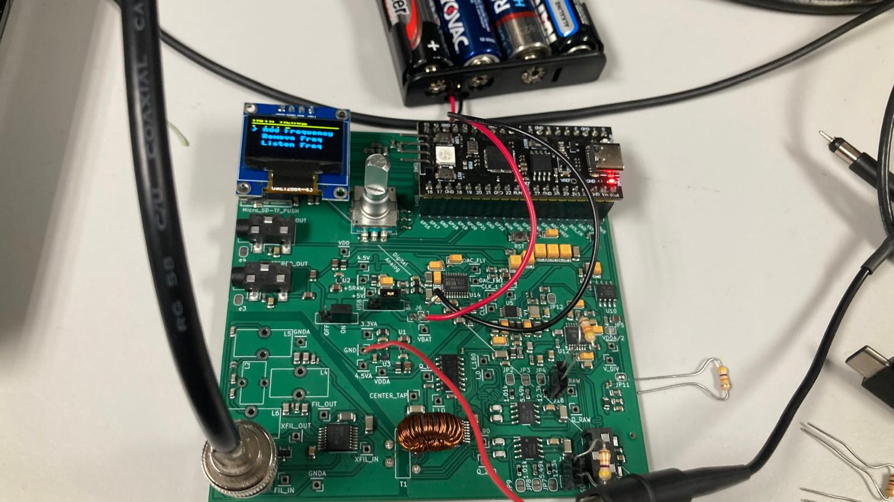

## Results

Base Goals

- [x]  Minimum Discernable signal less than 1uV
  - Achieved 1mV
- [ ]  Switching between AM and HF bands
  - Only tested for AM band. 
- [x]  Intuitive interface
  - Got it. See /Software 
- [x]  Portability
   - Battery power works well. Antenna and Board grounds have to be tied together for portable antenna grounding
- [x]  Dual power mode (battery and usb)
   - Got it!! Both work as intended.

 Reach Goals:

- [x]  Low noise (-60dB)
  - Achieved -90dB
  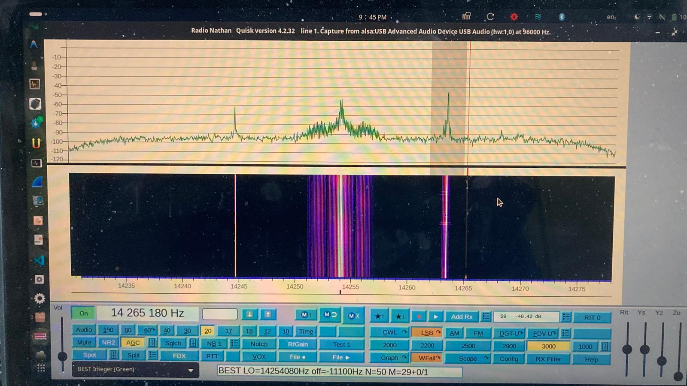
- [/]  High Image Rejection (-20dB)
- Achieved -15dB to -25dB depending on individual resistor pairs. 
- [ ]  Can record radio signals
   - Unable to test 

### Images
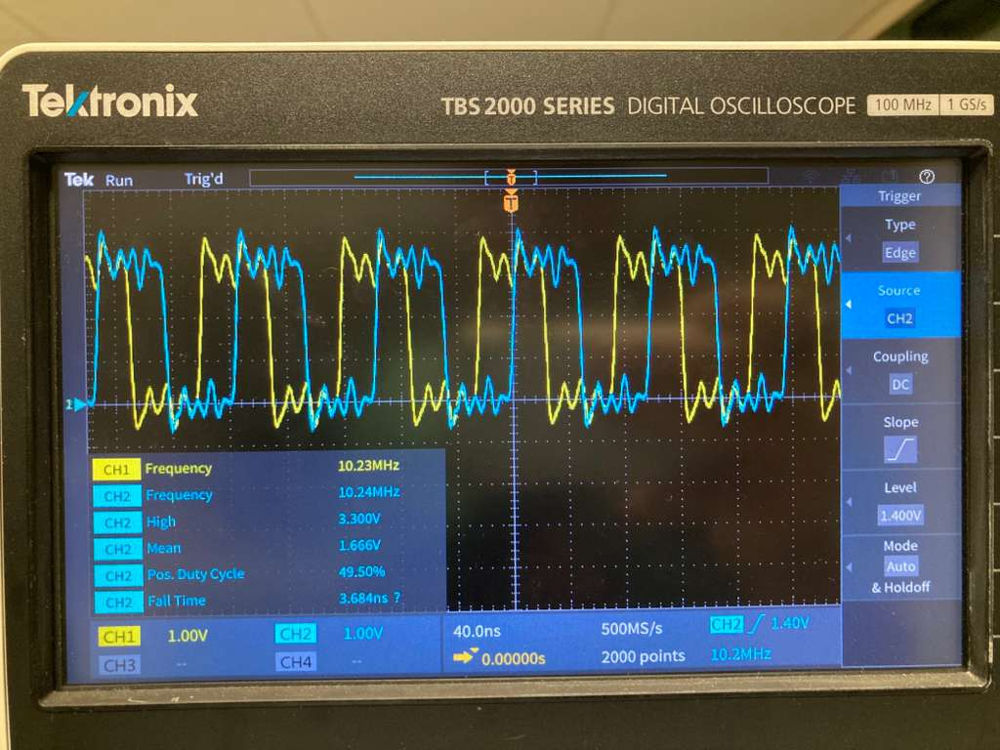

## Future Work

- [ ] Input I and Q signls into pico via ADC 
   - ADC verification 
- [ ] Tracelength matching for Q_LO and I_LO
- [ ] Manufacture optional LP and BP Filters
- [ ] RF signal processing software

### Optional
- [ ] Adding option for lower gain in Intrumentation Amplifier. 
